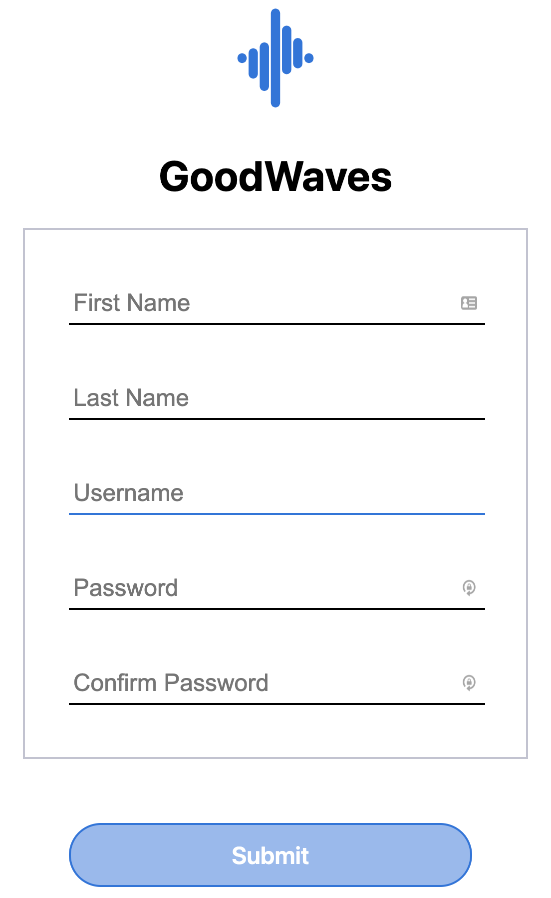
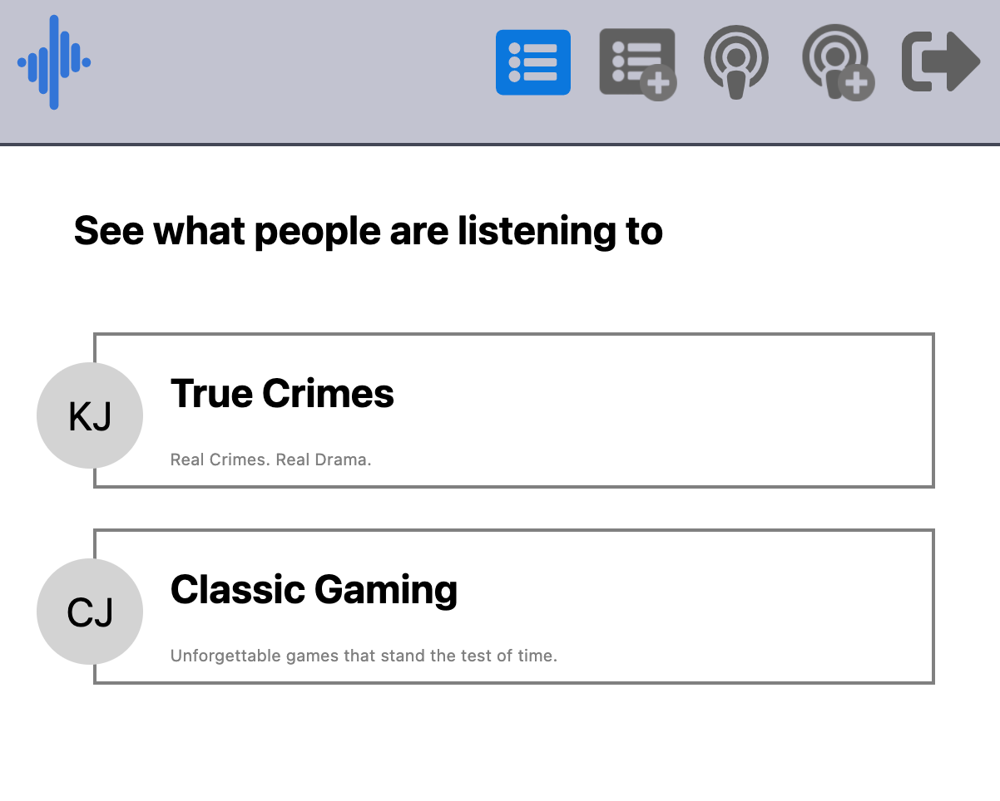
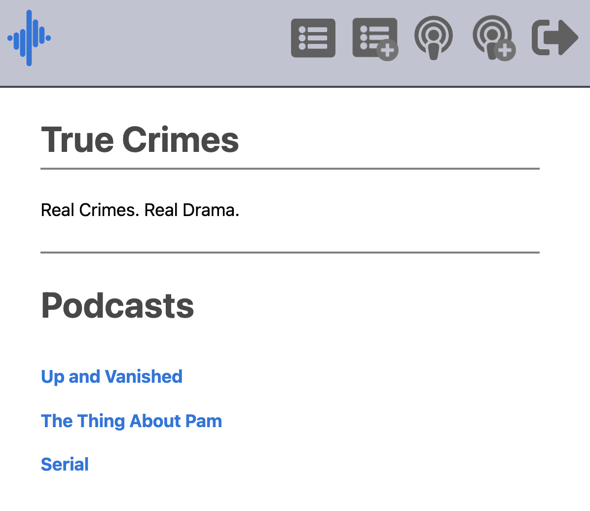
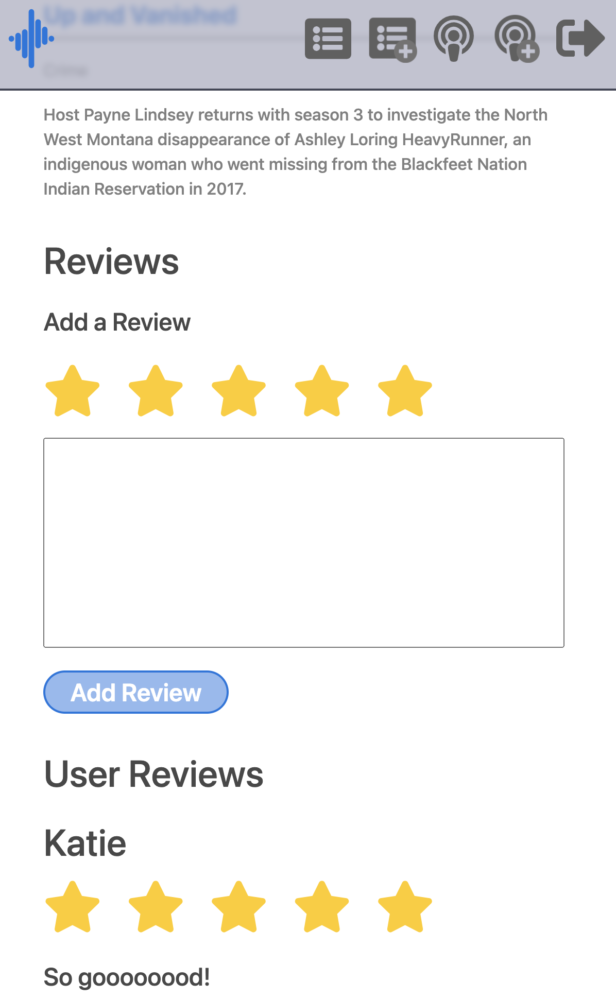
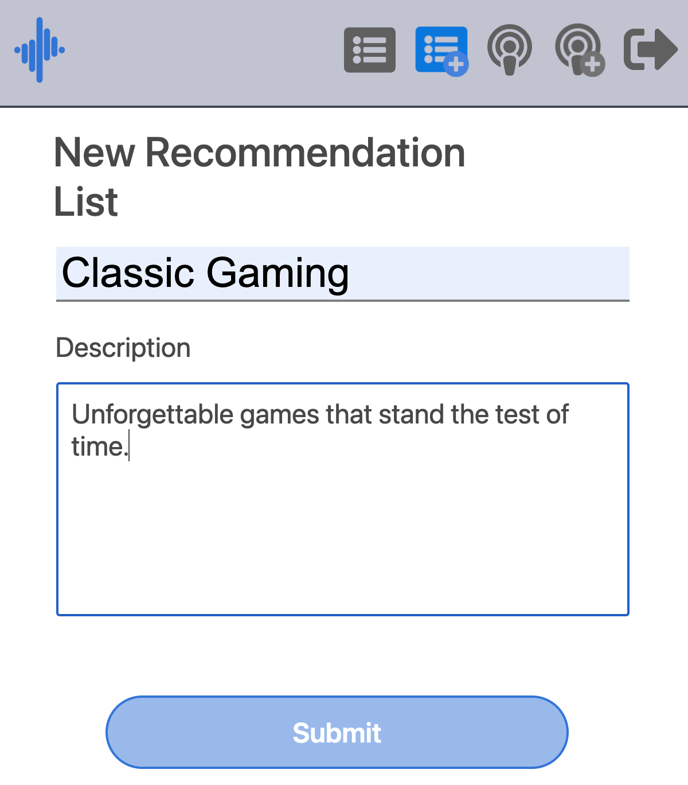
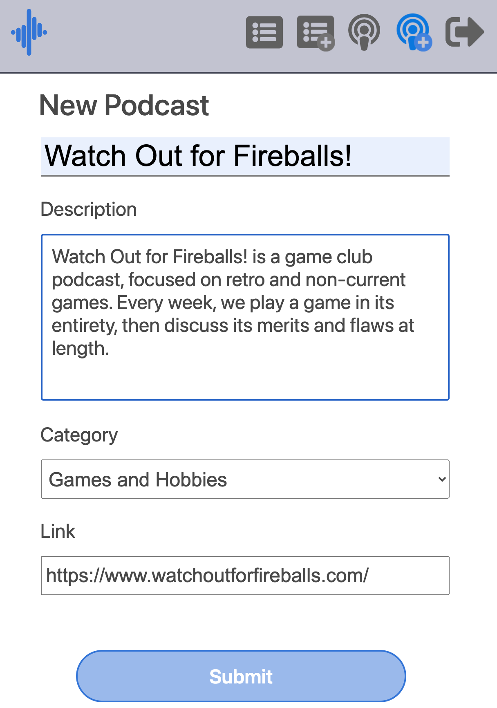
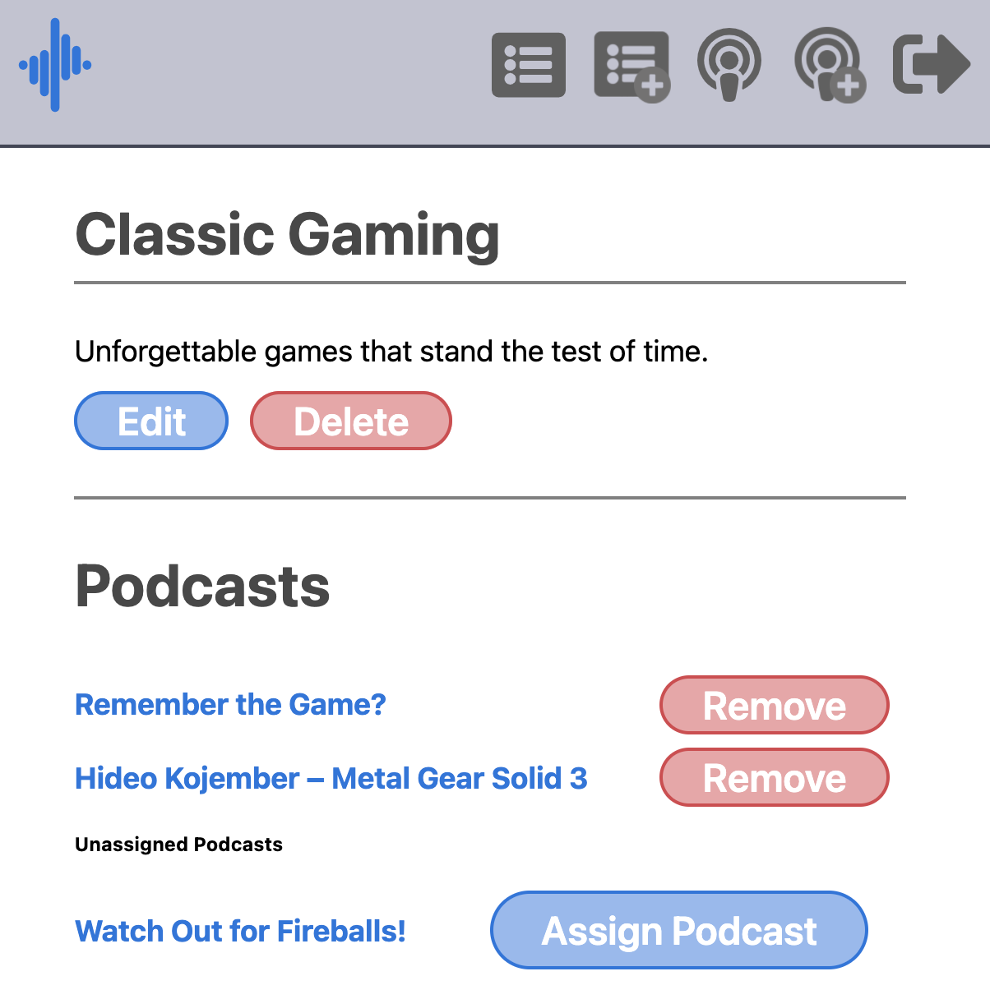
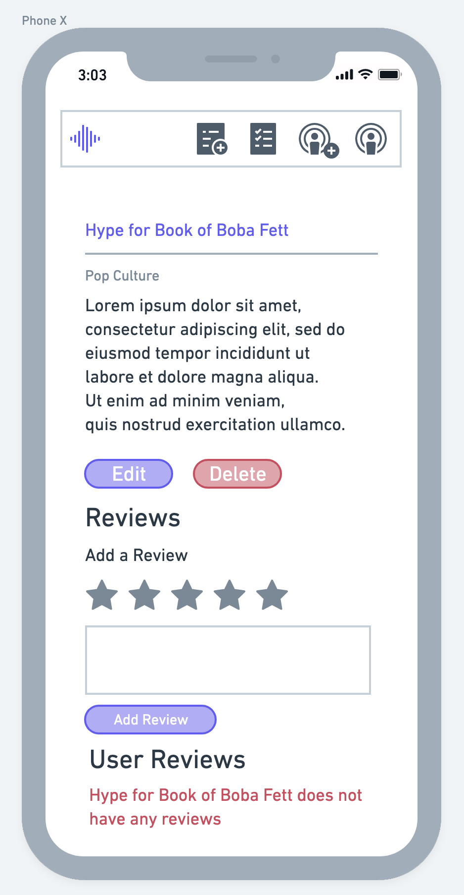
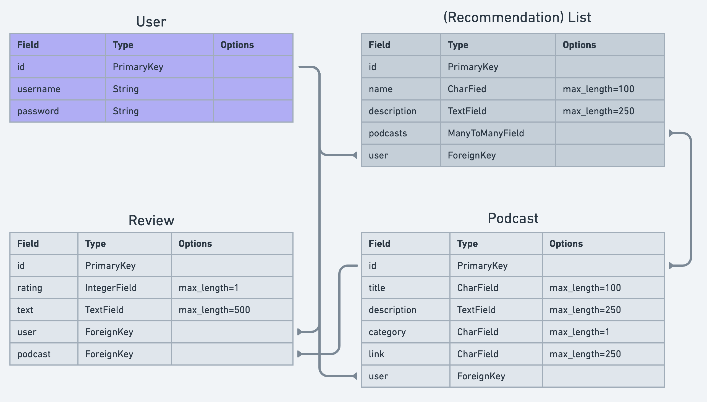

# GoodWaves

### Hear what other people are listening to with podcast recommendations

## Getting Started

#### To start using GoodWaves, open the app [here](https://good-waves.herokuapp.com/)!

#### Once at GoodWaves, you can create a new account to begin viewing other user's recommendations.

#### View other user curated recommendation lists to begin browsing podcasts.

#### From there you can try out different podcasts.

#### Checkout reviews on podcasts and add your own reviews as well.

#### If you want to create your own podcast recommendations, you can begin creating your own recommendation lists and podcasts.

#### Then add podcasts to your lists for others to see!

## Technologies Used
* Python
* Django
* PostgreSQL
* JavaScript
* HTML
* CSS

## Wireframe

#### Additional wireframes can be seen [here](https://trello.com/b/aictIgTF/goodwaves)

## Attributions:

* Icons from [FontAwesome](https://fontawesome.com/)
* Link preview generation from [linkpreview](https://my.linkpreview.net/)
* RegExp for websites from [foufos](https://stackoverflow.com/questions/3809401/what-is-a-good-regular-expression-to-match-a-url)

## Next Steps
- [x] Mobile Login Screen
- [x] Mobile User Sign Up
- [x] New Podcast Recommendations List View
- [x] New Podcast View
- [x] Recommendation List Details View
- [x] Podcast Recommendations List View
- [x] Edit Podcast Recommendations View
- [x] Delete Podcast Recommendations Confirmation View
- [x] Podcasts List View
- [x] Podcast Details View
- [x] Add Review to Podcast
- [x] Edit Podcast View
- [x] Delete Podcast Confirmation View
- [x] Edit User Reviews View
- [x] Delete User Reviews Confirmation View
- [x] Associate/Unassociate Podcast with Recommendation List
- [x] Embedded link block to auto populate podcast info
- [ ] Mark Reviews as Helpful
- [ ] User Profile View
- [ ] Change User Profile Image
- [ ] Desktop Views